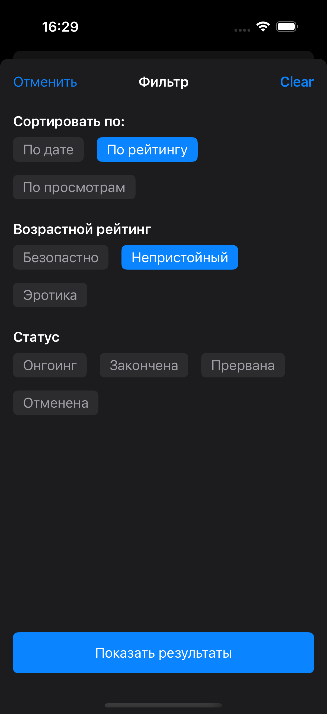
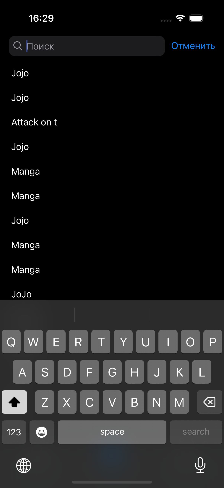
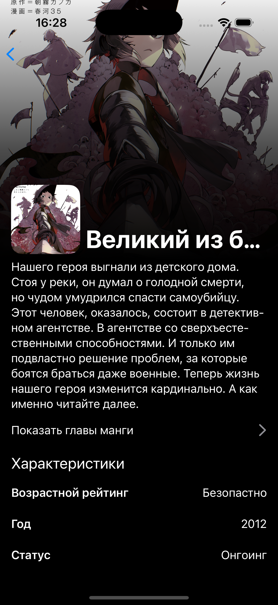
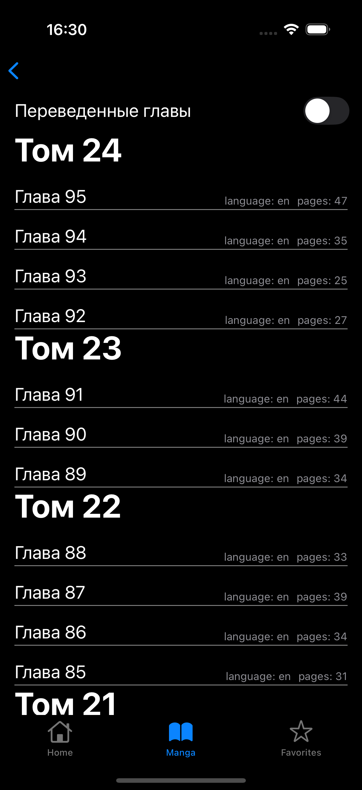

# MangaApp

<div align="center">
    
    
    
    
    
    
    
</div>

## О проекте

MangaApp - это iOS-приложение для просмотра и чтения манги, использующее открытое API MangaDex.

## Технологии и стек
- **MVP**
- **Coordinator**
- **Swinject**
- **Kingfisher**
- **URLSession**
- **UIKit**
- **Swift**

## API
Приложение использует [MangaDex API](https://api.mangadex.org/)

## Установка и запуск

1. Клонируйте репозиторий
2. Установите зависимости через CocoaPods:
```bash
pod install
```
