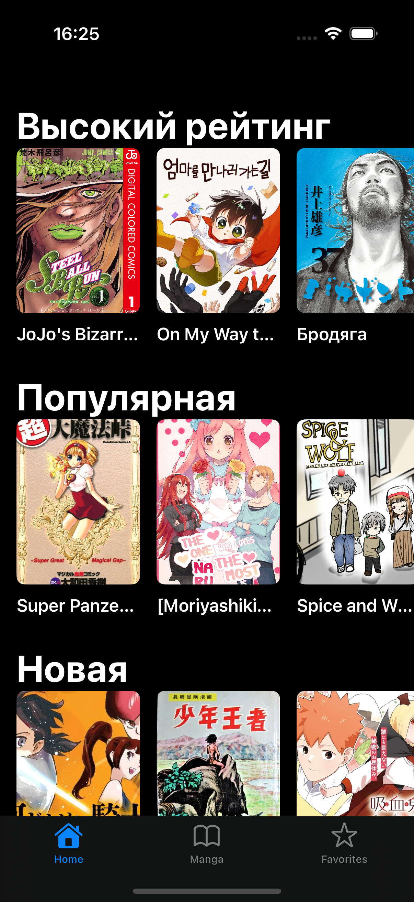

# MangaApp

<div align="center">
    
    
    
    
    
    
    
</div>

## О проекте

MangaApp - это iOS-приложение для просмотра и чтения манги, использующее открытое API MangaDex.
Основными целями проекта было на практике расссмотреть врхитектуру MVP, верстку сложных коллекций, локальное хранение данных, научиться декомпозировать сложные UI-элементы на простые.

## Технологии и стек
- **MVP**
- **Coordinator**
- **Swinject**
- **Kingfisher**
- **UserDefaults**
- **URLSession**
- **UIKit**
- **Swift**

## Функционал и возможности

Есть 2 таба: Home и MangaList.
Home отображает 3 списка(новые,популярные,высокий рейтинг), MangaList имеет больше возможностей. Она отображает список манги, имеется также поиск(с сохранением в UserDefaults запросов) и фильтр(набор из 3 полей).

В зависимотсти от состояния View на экранах с данными отображается: лоадер/баннер/сами данные.

MangaDetail - экран манги, отображается доступная информация в виде коллекции с анимациями у изображения. ChaptersList - список глав отсортированных и сгруппированных по томам. Также есть возможность смотреть главы только на своем языке. ChapterDetail - просто список из картинок главы манги

## API
Приложение использует [MangaDex API](https://api.mangadex.org/)

## Установка и запуск

1. Клонируйте репозиторий
2. Установите зависимости через CocoaPods:
```bash
pod install
```
